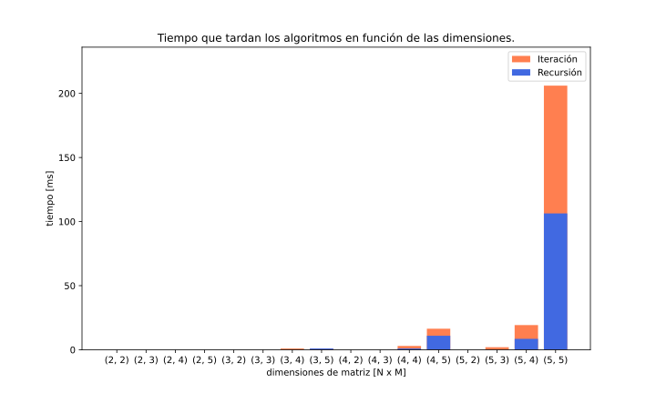
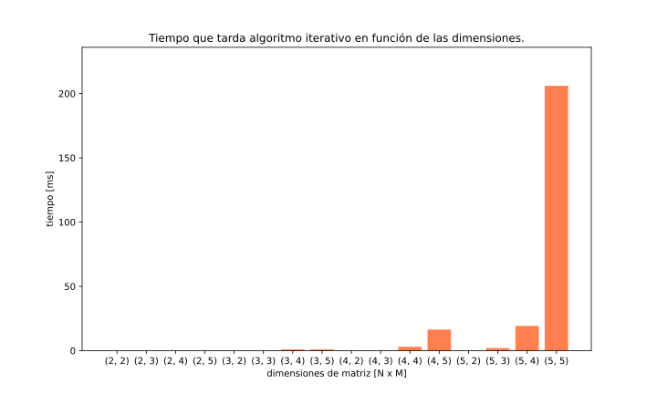

# TAREA-1-EL4203
Tarea 1 del curso EL4203, desarrollada por Matías Carvajal

## Parte Teórica
Para responder este apartado se recurrió a las cátedras del curso.
1. **¿Qué es un paradigma de programación?:** corresponde a la forma en que se modela un problema de programación. Como definición formal, se podría entender como un conjunto diferenciado de conceptos (teorías, métodos, entre otros) que definen lo que constituye un área particular". En este caso, el área particular sería la programación.
   
2. **¿En qué se basa la programación orientada a objetos?:** corresponde a un paradigma de programación que se basa en el uso de clases, la cual corresponde a un "molde" para crear objetos que tienen atributos y funcionalidades. Su énfasis son los datos (modificación de atributos) más que el procedimiento
   
3. **¿Cuál es la diferencia entre recursividad e iteración, y cómo se relaciona esto con la notación big 𝑂?** en primer lugar, la notación big 𝑂 nos dice el tiempo que tarda en ejecutarse un algoritmo. Es la forma de comparar la eficiencia de distintos enfoques de un problema. En el caso de recursividad, la función se llama a sí misma (directa o indirectamente), mientras que la iteración utiliza bucles para repetir instrucciones un número determinado de veces. Generalmente, dado que es mucho más facil mantener el control del proceso en la iteración, resulta más eficiente que la recursividad en terminos de big 𝑂.
   
4. **¿Cuál es la diferencia de rendimiento entre 𝑂(1) y 𝑂(𝑛)?:** 𝑂(1) indica que el tiempo es constante y no depende del tamaño de la entrada; 𝑂(𝑛) indica que el tiempo crecerá directamente proporcional al tamaño de la entrada.
   
5. **¿Cómo se calcula el orden en un programa que funciona por etapas?:** como se mencionó anteriormente, al realizar instrucciones que no dependan del tamaño de la entrada, el orden se considera 𝑂(1) (es decir, constante). Por otro lado, en bucles que se repiten n veces, el orden correspondería a 𝑂(n). De esta forma, se puede ir determinando el orden de cada etapa (la cual podría ser de otros estilos, como 𝑂(log(n)) en una busqueda binaria, por ejemplo). Al final, el orden total del programa corresponde a la suma de los distintos ordenes, omitiendo aquellos que sean constante, pues no dependen de la entrada.
   
6. **¿Cómo se puede determinar la complejidad temporal de un algoritmo recursivo?:** según se explicó antes, en un algoritmo recursivo la función se va llamando a si misma una determinada cantidad de veces hasta llegar al caso base. En un caso sencillo, la función debe llamarse a sí mismo n - veces hacía atras, su orden sería 𝑂(n). Sin embargo, si la situación se complejiza, se debe recurrir a encontrar la formula de recurrencia f(n) y, a partir de ella, encontrar su complejidad temporal. Como temas que no se han visto en el curso, pero se aprendieron en el curso de Algoritmos y Estructura de Datos del DCC, se pueden aplicar métodos de sustitución (y despejar la ecuación de recurrencia) o el Teorema Maestro para hallar el tiempo exacto que tarda el algoritmo en ejecutarse.

## Parte Práctica
El problema que se busca resolver es encontrar la cantidad de caminos posibles entre un punto A y B en una PCB. La PCB será representada por una matriz de dimensiones N x M, donde N son el número de columnas y M el de filas, mientras que A = (0, 0) y B = (N - 1, M - 1). Se supondrá que no se puede devolver en su camino y solo se puede acercar al punto B. Esto último implica que no puede ir en el sentido izquierdo o arriba, pues se alejaría del punto B.

El proyecto cuenta con dos scripts principales: `caminos.py` y `graphs.py`. El primero contiene la clase `Caminos(N, M)`, la cual se inicializa con las dimensiones (N, M) que tendrá la matriz que representa la PCB. Como métodos tiene `Caminos.recursive()`, la cual a través de un método recursivo encuentra los caminos posibles para llegar a B desde A; `Caminos.iterative()`, la cual hace lo mismo a través del método iterativo; y `Caminos.num_roads(iterative: bool)`, la cual originalmente calcula el número de caminos con un método determinado por el valor booleano `iterative` (True -> Método iterativo - False -> Método recursivo), pero al aplicarle el decorador `@decorator` retorna el tiempo que tarda la ejecución. Si se quisiera hallar todos los casos posibles, es decir, permitiendo subir o ir a la izquierda, debe descomentar los espacios donde se indica que se hacen los movimientos antes señalados. 

Por otro lado, en el otro script se encuentra el programa necesario para hacer las gráficas de los tiempos que tardan los algoritmos en ejecutarse, considerando como dimensiones los productos cartesianos entre `N0` y `Nf`  (modificables en el principio del archivo). Las imágenes de las gráficas las guarda en formato .svg y son 3: el gráfico de barras de ambos métodos y de cada uno de ellos por separado. Deberían verse como los ejemplos disponibles en el repositorio y que se muestran a continuación, donde se consideraron las dimensiones generadas desde 7 hasta 11.

Como se observa, la eficiencia del algoritmo recursivo es mayor al iterativo, pues el tiempo que tarda el segundo es prácticamente el doble que el primero. Como datos extra, para su ejecución en otros entornos, las librerías utilizadas fueron `numpy`, para el trabajo con arreglos; `matplotlib`, para la realización de gráficas; y `time` para la obtención del tiempo en el código.

